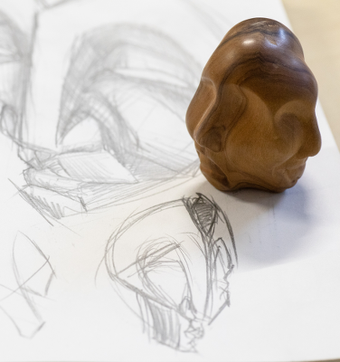
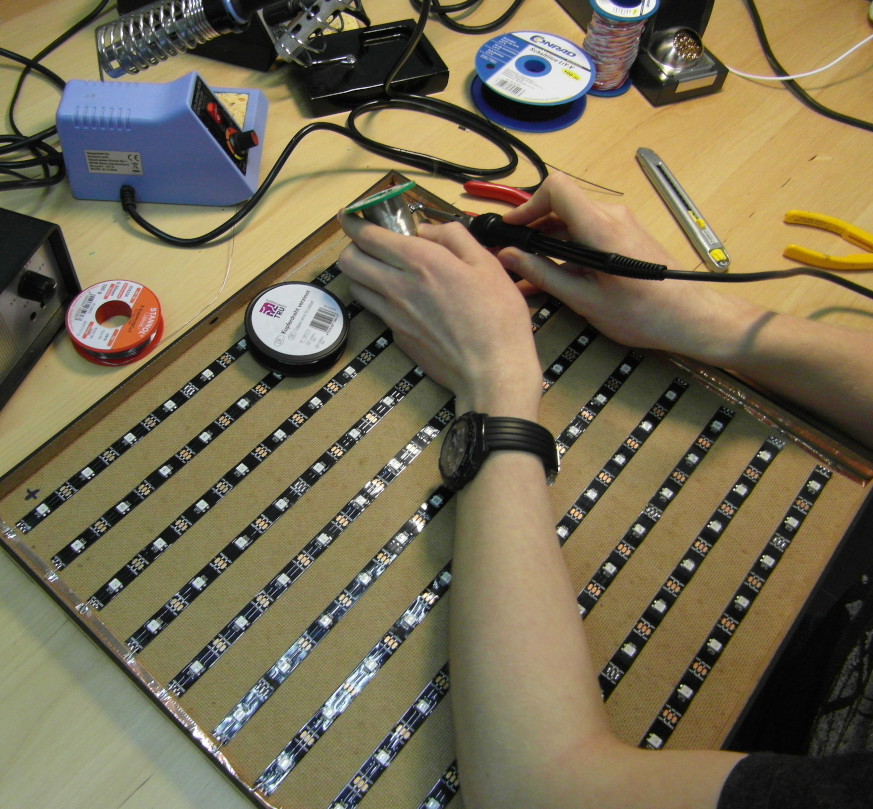
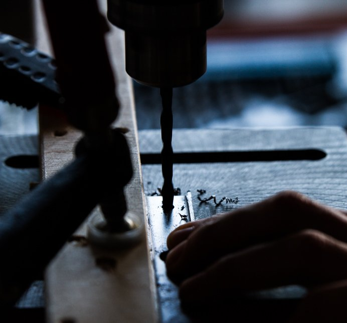
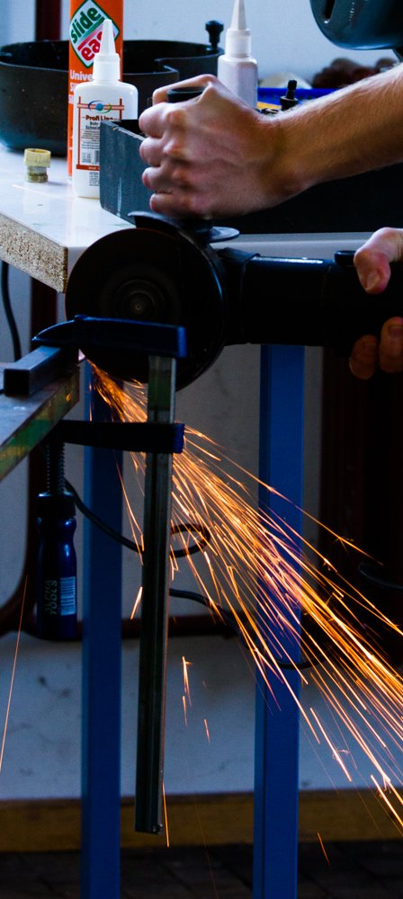
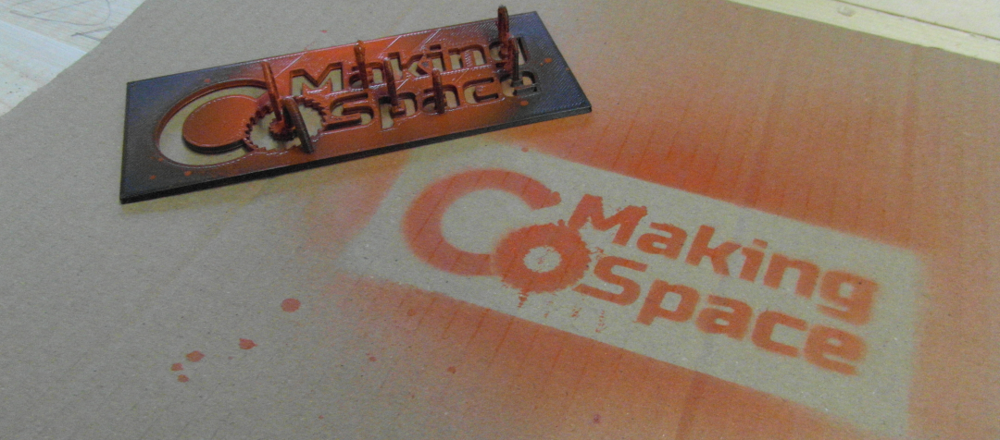

<link rel="stylesheet" href="assets/css/index.css">

<space-banner>
LET'S <i class="green">MAKE</i> A  DIFFERENCE TOGETHER
</space-banner>

<h3>WERDE TEIL DER WACHSENDEN MAKER-BEWEGUNG</h3>
<h1>Teile dir eine Werkstatt mit Gleichgesinnten.</h1>

Der Keller ist zu klein oder du würdest die Nachbarn stören? Eine Garage zu mieten ist zu teuer?
Lasst uns unsere Werkstatt teilen und die Kosten reduzieren!
 
 
 
Der CoMakingSpace ist eine offene Werkstatt für “Maker” aus verschiedensten Richtungen. Wir möchten,
dass alle realisieren können was auch immer sie sich ausdenken und bieten die nötigen Werkzeuge, Räume
und Fähigkeiten.
 
 
 
Wäre es nicht toll wenn du jederzeit an deinen Projekten arbeiten könntest, zum Beispiel nach
Feierabend?
Du brauchst nur eine große Werkstatt mit geeigneten Werkzeugen in deiner Nähe.

<btn-link href="Kontakt">
<a class="pure-button" href="/contact.html">
KOMM DOCH MAL VORBEI
</a>
</btn-link>

Diese Idee ist nicht neu: die sogenannte “Maker-Bewegung” begann einige Jahre bevor wir in Heidelberg aktiv
wurden und ist ein weltweites Phänomen. Sie wird von einer riesigen Gemeinschaft von Bastlern und Tüftlern
getragen, die die Kontrolle über die Gegenstände, die uns jeden Tag umgeben, wiedererlangen wollen. Die
Werkstätten, die sie dazu aufrechterhalten, werden auch "Makerspaces" oder "Fablabs" genannt. Neben einem
hohen Innovationsgrad hat das Prinzip von lokaler oder „Desktop“-Produktion das Potenzial, die
konventionelle Industrie in manchen Sektoren zu ersetzen während die große Bedeutung der Nachhaltigkeit
zunehmend akzeptiert wird.

<h1>Wir helfen dir...</h1>

... deine verrückten Ideen mit unseren Werkstätten und Rapid-Prototyping-Maschinen in coole Projekte
umzuwandeln

<h1>Gemeinschaftlich genutzte</h1>
<h3>Ausrüstung &amp; Werkstatt</h3>

Der Zugang zu einer breit gefächerten Auswahl an Handwerkzeugen, Elektrowerkzeugen, Maschinen,
Rapid-Prototyping-Ausrüstung und vielem mehr ermöglicht es unserer Gemeinschaft, Ideen zu greifbaren
Projekten zu entwickeln.

<space-link href="Mach mit">mehr erfahren</space-link>

<h1>Gemeinsame Gestaltung</h1>

Der CoMakingSpace ist der ideale Ort, um Mitstreiter für deine verrückten Projekte zu finden. Gemeinsam
etwas zu gestalten ist eine hervorragende Möglichkeit, Fähigkeiten zu erlernen und weiterzugeben.
 
 
Learn by doing - gemeinsam!

<space-link href="Mach mit">mehr erfahren</space-link>

<h1>Persönliche Entwicklung</h1>

“Making” ist eine Lebenseinstellung und man lernt nie aus. Es gibt immer neue Erfahrungen zu machen! Der
CoMakingSpace ist eine solidarische, gemeinschaftsbasierte Ressource die den Einzelnen hilft, ihre
persönlichen Fähigkeiten weiterzuentwickeln.

<space-link href="Mach mit">mehr erfahren</space-link>

<image-slider>

JEDES PROJEKT IST EINE CHANCE, DARAN ZU WACHSEN

</image-slider>

<h1>Lernst auch du am liebsten durch praktische Anwendung? 
Komm mit deinen Ideen in den CoMakingSpace und lerne etwas Neues.</h1>
<btn-link href="Mach mit">
<a class="pure-button" href="/join_us.html">
ERLERNE NEUE FÄHIGKEITEN
</a>
</btn-link>

<h1>LET'S <i class="green">MAKE</i> A DIFFERENCE TOGETHER</h1>

Dinge im gemeinschschaftlich genutzten Raum mit Gleichgesinnten zu erschaffen hat viele Vorteile: zum
Beispiel gibt es jede Menge Platz, über den man sich vorübergehend ausbreiten kann, und Geräte die man sich
alleine nicht leisten würde weil man sie selten benötigt oder sie schlicht zu teuer sind.
 
 
Außerdem sind wir eine freundliche Gemeinschaft, die Inspiration oder neue Erkenntnisse in deine Arbeit
einbringen kann. Mitstreiter für größere Unterfangen zu finden oder einfach in Ruhe im Sozialbereich zu
reden ist genauso wichtig wie wirklich einen Hammer zu schwingen! Wenn ein Projekt unbekannte Techniken
beinhaltet gibt es meistens jemanden mit mehr Erfahrung, der dir helfen oder wertvolle Tipps geben kann.
 
---

